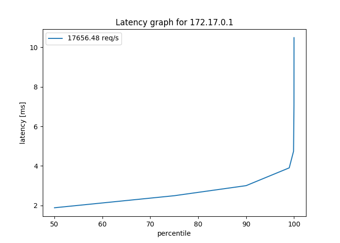

# dockerized wrk2 load generator

## Build image using buildkit

`DOCKER_BUILDKIT=1 docker build -t wrk2-docker .`

## Generate load - e.g. for 30 secconds

`docker run --rm wrk2-docker -t2 -c100 -d30s -R18000 --latency http://172.17.0.1/index.html`

## Save resulting report for later processing with wrk2img

`docker run -it --rm -v $(pwd):/root wrk2-docker -t2 -c100 -d30s -R18000 --latency http://172.17.0.1/index.html > R18000`

Pipe the genrated file into `wrk2img` for a graphical representation of the observed latency

`cat R18000 | wrk2img output.png`

## Credit

* Source code (C) [giltene/wrk2](https://github.com/giltene/wrk2)
* [Http Load Testing With Wrk2](https://www.yangyang.cloud/blog/2018/11/05/http-load-testing-with-wrk2/)
* [An Introduction to Load Testing](https://www.digitalocean.com/community/tutorials/an-introduction-to-load-testing)
